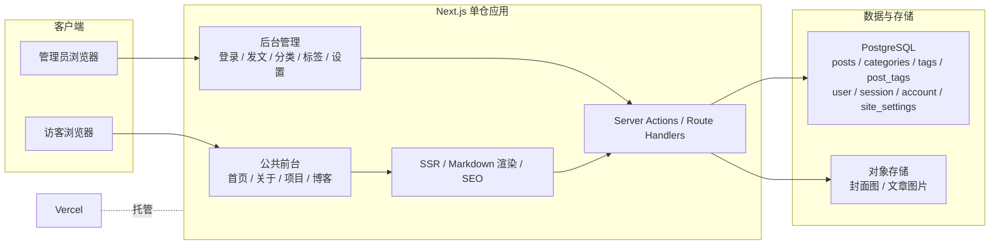
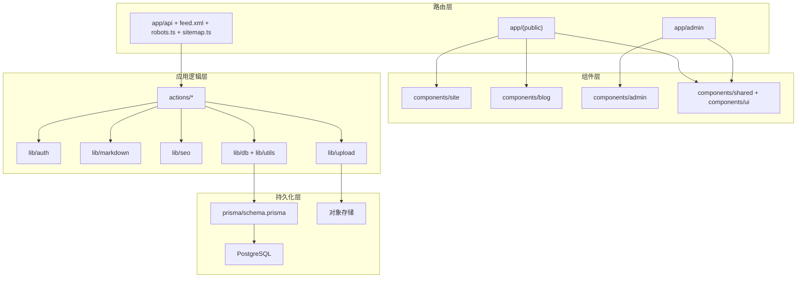
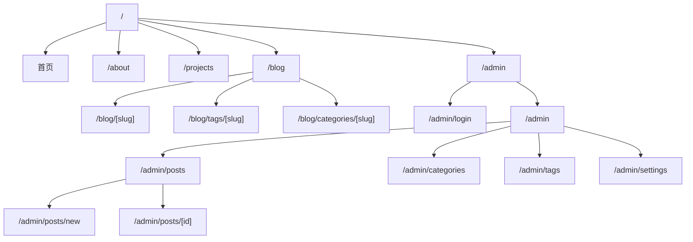
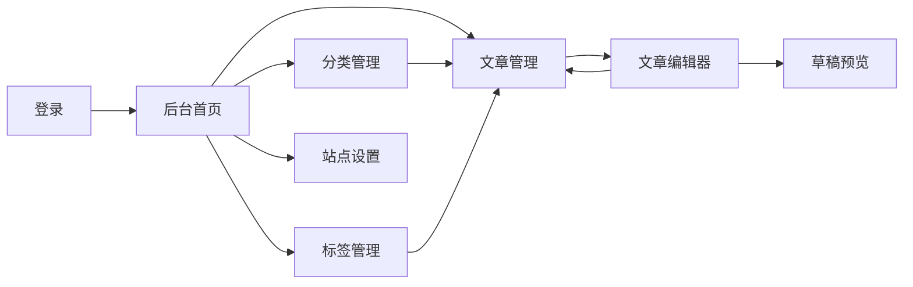
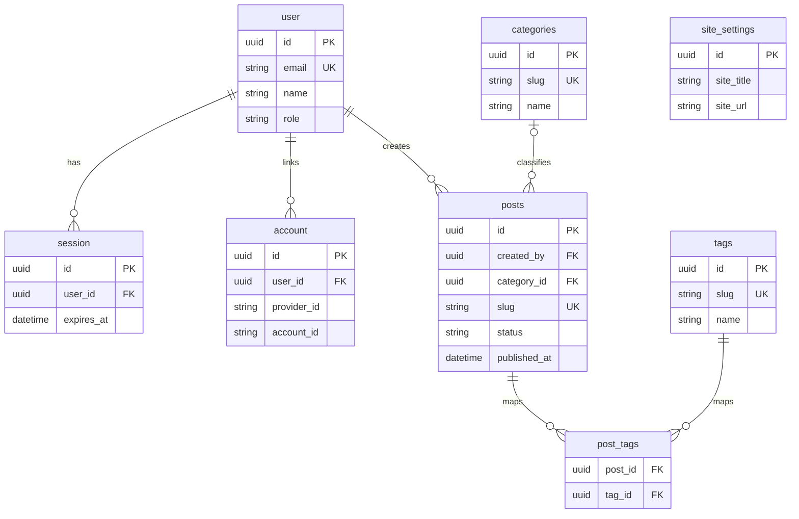
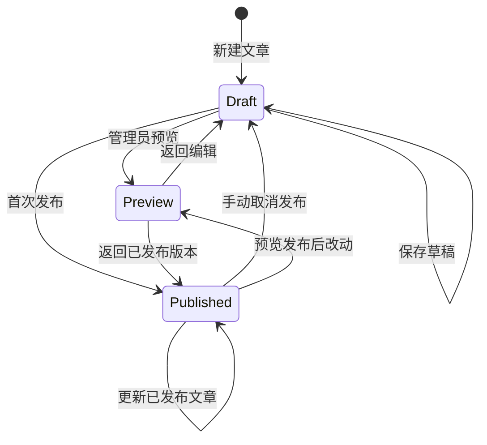
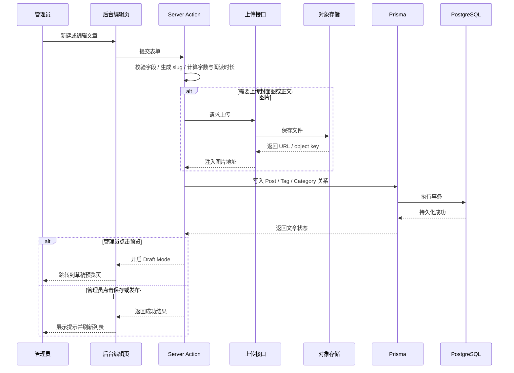
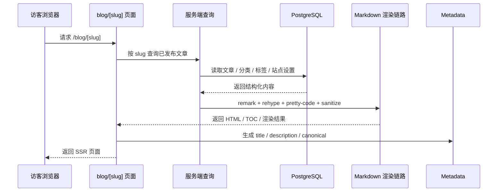
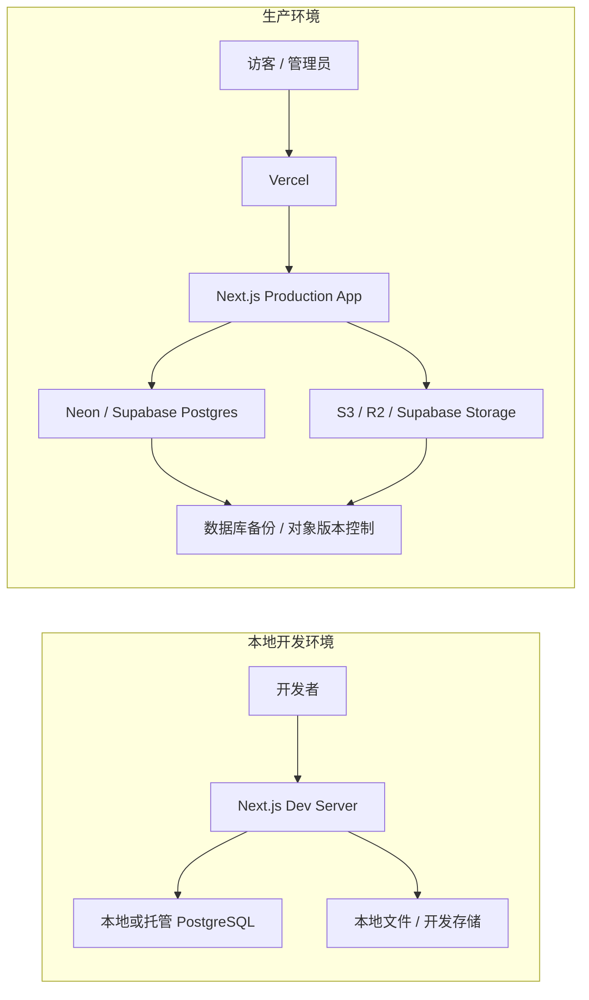
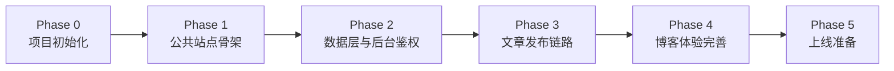

# 轻量个人博客全栈蓝图

> 目标：基于 React + shadcn/ui，搭建一套“自定义前台 + 标准博客后台”的轻量个人博客系统。
> 适用场景：单作者、强调品牌感和页面设计、博客内容通过后台发布、正文使用 Markdown。
> 确定架构：Next.js 单仓模块化全栈，不做前后端拆仓。

## 1. 项目定位

这个项目的核心不是“套一个博客主题”，而是做一个有个人品牌感的内容站点：

- 前台：首页、关于、项目、专题页等由代码驱动，自由设计 UI。
- 博客：文章、标签、分类、列表页、详情页遵循标准内容系统。
- 后台：只负责内容管理，不负责高度定制化页面搭建。

这套边界最适合你的目标：

- 首页和导航可以完全自己 DIY。
- 博客系统保持标准化，后期维护简单。
- 既能满足个人表达，也能逐步扩展为项目展示站、知识库或文档站。

## 2. 已确定实现路线

### Next.js 单仓模块化全栈

- 前台、后台、API、SSR、SEO 在同一个项目里。
- 自定义页面和博客系统共享组件、主题、鉴权、数据库连接。
- 部署简单，维护成本低。

选择这条路线的原因：

- 你要的是“轻量”，不是“企业 CMS”。
- 你是单作者，后台功能边界明确。
- 后续如果要加项目展示、项目文档、留言板、搜索，都可以在同一项目内演进。

## 3. 技术选型建议

### 核心栈

- 前端框架：Next.js App Router
- 语言：TypeScript
- UI：shadcn/ui
- 数据库：PostgreSQL
- ORM：Prisma
- 鉴权：Better Auth（固定方案，配合 Prisma Adapter）
- Markdown 渲染：remark + rehype
- 代码高亮：rehype-pretty-code
- 图片存储：本地开发用本地文件，线上用 S3 / R2 / Supabase Storage
- 部署：Vercel + Neon 或 Vercel + Supabase

### 选型理由

- Next.js 适合做一体化的全栈站点，尤其适合 SEO 和内容页面。
- shadcn/ui 适合同时覆盖公共前台和后台表单、表格、弹窗等基础交互。
- PostgreSQL 足够支撑文章、标签、分类、搜索和未来的扩展需求。
- Markdown 正文足够轻量，也方便迁移和长期维护。

### 鉴权落地约束

- MVP 固定使用一套鉴权方案，不再并行保留多个实现分支。
- 采用 Better Auth + Prisma Adapter，认证表结构遵循鉴权库默认 schema 管理。
- 业务上仍按“单管理员博客”建模，只开放管理员登录，不在第一版引入复杂角色权限。
- 如果后续确认只需要极简凭证登录，可以单独新增 ADR 再评估是否切换到自建 Credentials + Session。

## 4. 核心架构

```text
访客浏览器
    |
    v
Next.js 应用
    |-- 公共前台页面：首页 / 关于 / 项目 / 博客
    |-- 博客渲染：列表 / 详情 / 标签 / 分类
    |-- 后台管理：admin 登录 / 发文 / 分类 / 标签
    |
    v
PostgreSQL
    |-- posts
    |-- categories
    |-- tags
    |-- post_tags
    |-- user / session / account
    |-- site_settings
    |
    v
对象存储
    |-- 封面图
    |-- 文章图片
```

### 系统上下文图



### 应用模块图



### 架构原则

- 用模块化单体，不做微服务。
- 博客正文存数据库，元数据结构化。
- 自定义页面由代码维护，不放进后台低代码配置。
- 后台仅支持标准内容对象：文章、标签、分类、站点设置。

## 5. 功能范围

### MVP 必须具备

- 自定义首页
- 关于页
- 项目页
- 顶部导航
- 深色/浅色主题切换
- 博客列表页
- 文章详情页
- 标签页
- 分类页
- 后台登录
- 文章增删改查
- 标签增删改查
- 分类增删改查
- Markdown 编辑与预览
- 草稿和发布状态
- 草稿预览
- SEO 基础能力：title、description、sitemap、robots.txt、RSS

### MVP 明确不做

- 多作者协作
- 评论系统
- 点赞收藏
- 全站复杂搜索
- 页面搭建器
- 可视化 block editor
- 国际化
- 全量权限系统

## 6. 非功能需求

### 性能

- 首页和博客详情页首屏尽量控制在 2 秒内
- 博客详情页服务端渲染，利于 SEO
- 列表页分页加载，不一次性渲染全部文章

### 可维护性

- 单仓统一管理
- 公共布局、主题、卡片、表单统一封装
- 自定义页面和博客模块分目录管理

### 安全性

- 后台必须登录
- Markdown 渲染必须做内容安全处理
- 图片上传限制类型与大小
- 生产环境使用 HttpOnly Cookie 会话

### 成本

- 按“个人博客低流量”设计，不为假想高并发过度设计
- 优先使用托管数据库和托管部署平台降低运维成本

## 7. 关键架构决策（ADR）

### ADR-001：采用单仓模块化全栈，而不是前后端分离

#### Context

项目是个人博客，前台需要高自定义，后台功能却相对标准，且预期维护者主要是你自己。

#### Decision

采用 Next.js 单仓模块化全栈架构，前台、后台、API、SSR 放在同一项目内。

#### Consequences

Positive:

- 开发体验统一
- 部署和维护简单
- 组件和主题可复用

Negative:

- 后续如果要开放移动端或第三方消费 API，需要再明确接口边界

### ADR-002：博客正文使用 Markdown，元数据结构化存储

#### Context

你希望从后台发文，同时保持内容轻量、可迁移、可长期维护。

#### Decision

文章正文保存为 Markdown 文本，标题、摘要、slug、分类、标签、SEO、发布时间等存储为结构化字段。

#### Consequences

Positive:

- 编辑成本低
- 内容迁移简单
- 后台逻辑清晰

Negative:

- 如果未来大量使用富交互内容，纯 Markdown 会受限

### ADR-003：自定义页面由代码维护，不进入后台管理

#### Context

首页、关于、项目页都强调设计表达，不适合用标准 CMS 表单描述。

#### Decision

首页、关于、项目等页面由 React 代码维护，后台只管博客内容和站点基础设置。

#### Consequences

Positive:

- 设计自由度高
- 页面质量更稳定
- 避免做半套页面搭建器

Negative:

- 内容改动需要走代码发布流程

### ADR-004：MVP 鉴权固定为 Better Auth，而不是并行保留多种实现

#### Context

个人博客后台只需要单管理员登录，但如果同时保留 Better Auth、NextAuth 或自建密码登录三种思路，数据模型和实现边界会反复摇摆。

#### Decision

MVP 固定采用 Better Auth + Prisma Adapter。认证相关表遵循库默认 schema，业务侧只额外约束“仅管理员可进入后台”。

#### Consequences

Positive:

- 数据模型更稳定
- Phase 2 可以直接落地，不会因为 auth 选型反复返工
- 会话、安全策略和后续扩展能力更清晰

Negative:

- 需要接受鉴权库自带的表结构，而不是手写最简账号表

## 8. 建议的目录结构

```text
.
├── app
│   ├── (public)
│   │   ├── page.tsx
│   │   ├── about
│   │   │   └── page.tsx
│   │   ├── projects
│   │   │   └── page.tsx
│   │   ├── blog
│   │   │   ├── page.tsx
│   │   │   ├── [slug]
│   │   │   │   └── page.tsx
│   │   │   ├── tags
│   │   │   │   └── [slug]
│   │   │   │       └── page.tsx
│   │   │   └── categories
│   │   │       └── [slug]
│   │   │           └── page.tsx
│   ├── admin
│   │   ├── login
│   │   │   └── page.tsx
│   │   ├── layout.tsx
│   │   ├── page.tsx
│   │   ├── posts
│   │   │   ├── page.tsx
│   │   │   ├── new
│   │   │   │   └── page.tsx
│   │   │   └── [id]
│   │   │       └── page.tsx
│   │   ├── categories
│   │   │   └── page.tsx
│   │   ├── tags
│   │   │   └── page.tsx
│   │   └── settings
│   │       └── page.tsx
│   ├── feed.xml
│   │   └── route.ts
│   ├── robots.ts
│   ├── sitemap.ts
│   └── api
│       └── upload
│           └── route.ts
├── components
│   ├── site
│   ├── blog
│   ├── admin
│   ├── shared
│   └── ui
├── lib
│   ├── auth
│   ├── db
│   ├── markdown
│   ├── seo
│   ├── upload
│   └── utils
├── actions
│   ├── posts.ts
│   ├── categories.ts
│   ├── tags.ts
│   └── settings.ts
├── prisma
│   └── schema.prisma
├── styles
├── public
├── docs
│   └── plans
└── site.config.ts
```

### 目录设计说明

- `app/(public)`：公共前台页面。
- `app/admin`：后台管理界面。
- `components/site`：首页、关于、项目页专用模块。
- `components/blog`：博客卡片、目录、文章渲染等。
- `components/admin`：列表、表单、筛选器、编辑器等。
- `site.config.ts`：导航、社交链接、基础常量。

## 9. 页面清单

| 路由                      | 页面名称 | 类型   | 说明                           |
| ------------------------- | -------- | ------ | ------------------------------ |
| `/`                       | 首页     | 代码页 | 自定义视觉首页，强调品牌感     |
| `/about`                  | 关于     | 代码页 | 个人介绍、经历、擅长方向       |
| `/projects`               | 项目     | 代码页 | 项目列表或精选案例             |
| `/blog`                   | 博客列表 | 标准页 | 文章列表、分页、筛选信息       |
| `/blog/[slug]`            | 文章详情 | 标准页 | Markdown 渲染、目录、相关文章  |
| `/blog/tags/[slug]`       | 标签详情 | 标准页 | 某个标签下的文章集合           |
| `/blog/categories/[slug]` | 分类详情 | 标准页 | 某个分类下的文章集合           |
| `/admin/login`            | 后台登录 | 管理页 | 管理员登录                     |
| `/admin`                  | 后台首页 | 管理页 | 数据概览、快捷入口             |
| `/admin/posts`            | 文章管理 | 管理页 | 列表、筛选、编辑入口           |
| `/admin/posts/new`        | 新建文章 | 管理页 | Markdown 编辑、基础字段填写    |
| `/admin/posts/[id]`       | 编辑文章 | 管理页 | 修改文章内容和发布状态         |
| `/admin/categories`       | 分类管理 | 管理页 | 分类 CRUD                      |
| `/admin/tags`             | 标签管理 | 管理页 | 标签 CRUD                      |
| `/admin/settings`         | 站点设置 | 管理页 | 站点标题、描述、头像、社交链接 |

### 站点路由信息架构图



### 后台信息架构图



## 10. 数据模型设计

### 数据关系图（ER）



说明：

- `user`、`session`、`account` 属于 Better Auth 认证域。
- `posts` 是核心内容表，向上关联作者 `user`，向侧面关联 `categories` 和 `tags`。
- `site_settings` 是全站单例配置表，独立存在，不参与内容关系链。

### 10.1 user（Better Auth）

用于后台登录，第一版只考虑管理员。

认证相关表直接采用 Better Auth 默认 schema（如 `user`、`session`、`account` 等）。第一版不再额外维护一套平行的业务 `users` 表；文章作者关系直接关联认证 `user`。

| 字段       | 类型      | 说明                   |
| ---------- | --------- | ---------------------- |
| id         | uuid      | 主键                   |
| email      | varchar   | 登录邮箱，唯一         |
| name       | varchar   | 管理员名称             |
| role       | varchar   | 扩展字段，默认 `admin` |
| created_at | timestamp | 创建时间               |
| updated_at | timestamp | 更新时间               |

### 10.2 posts

博客文章主表。

| 字段                 | 类型      | 说明                  |
| -------------------- | --------- | --------------------- |
| id                   | uuid      | 主键                  |
| title                | varchar   | 标题                  |
| slug                 | varchar   | URL 唯一标识，唯一    |
| excerpt              | text      | 摘要                  |
| cover_image_url      | text      | 封面图                |
| content_markdown     | text      | Markdown 正文         |
| status               | varchar   | `draft` / `published` |
| category_id          | uuid      | 所属分类，可空        |
| published_at         | timestamp | 发布时间              |
| reading_time_minutes | int       | 阅读时长，可程序计算  |
| word_count           | int       | 字数，可程序计算      |
| seo_title            | varchar   | SEO 标题              |
| seo_description      | text      | SEO 描述              |
| canonical_url        | text      | 规范地址，可空        |
| is_featured          | boolean   | 是否精选              |
| created_by           | uuid      | 创建人，关联 user.id  |
| created_at           | timestamp | 创建时间              |
| updated_at           | timestamp | 更新时间              |

### 10.3 categories

博客分类表。建议单篇文章只属于一个分类。

| 字段        | 类型      | 说明            |
| ----------- | --------- | --------------- |
| id          | uuid      | 主键            |
| name        | varchar   | 分类名称        |
| slug        | varchar   | 分类 slug，唯一 |
| description | text      | 分类描述        |
| created_at  | timestamp | 创建时间        |
| updated_at  | timestamp | 更新时间        |

### 10.4 tags

博客标签表。建议支持多标签。

| 字段        | 类型      | 说明            |
| ----------- | --------- | --------------- |
| id          | uuid      | 主键            |
| name        | varchar   | 标签名          |
| slug        | varchar   | 标签 slug，唯一 |
| description | text      | 标签描述，可空  |
| color       | varchar   | 标签色值，可空  |
| created_at  | timestamp | 创建时间        |
| updated_at  | timestamp | 更新时间        |

### 10.5 post_tags

文章和标签的多对多关系表。

| 字段    | 类型 | 说明          |
| ------- | ---- | ------------- |
| post_id | uuid | 关联 posts.id |
| tag_id  | uuid | 关联 tags.id  |

主键建议为 `(post_id, tag_id)` 组合键。

### 10.6 site_settings

全站基础信息。

| 字段             | 类型      | 说明                 |
| ---------------- | --------- | -------------------- |
| id               | uuid      | 主键                 |
| site_title       | varchar   | 站点标题             |
| site_subtitle    | varchar   | 站点副标题           |
| site_description | text      | 站点描述             |
| site_url         | text      | 站点地址             |
| logo_url         | text      | Logo 地址            |
| avatar_url       | text      | 头像地址             |
| github_url       | text      | GitHub 链接          |
| x_url            | text      | X/Twitter 链接，可空 |
| email            | varchar   | 联系邮箱，可空       |
| footer_text      | text      | 页脚文案，可空       |
| created_at       | timestamp | 创建时间             |
| updated_at       | timestamp | 更新时间             |

约束建议：全站仅保留一条 `site_settings` 记录。实现上可以固定主键、限制只允许 `upsert`，或者在应用层保证单例读取与写入。

### 10.7 projects（可选）

如果你后面希望项目页不是纯代码静态，也可以引入项目表。第一版可选。

| 字段             | 类型      | 说明               |
| ---------------- | --------- | ------------------ |
| id               | uuid      | 主键               |
| name             | varchar   | 项目名称           |
| slug             | varchar   | 项目 slug          |
| summary          | text      | 简介               |
| cover_image_url  | text      | 封面图             |
| content_markdown | text      | 详情内容，可空     |
| repo_url         | text      | 代码仓库地址，可空 |
| demo_url         | text      | 在线地址，可空     |
| sort_order       | int       | 排序               |
| is_published     | boolean   | 是否展示           |
| created_at       | timestamp | 创建时间           |
| updated_at       | timestamp | 更新时间           |

## 11. Prisma 建模建议

### 最小 MVP 模型

- Auth tables（`user` / `session` / `account`，由 Better Auth 管理）
- Post
- Category
- Tag
- PostTag
- SiteSetting

### 关系建议

- `Category 1 -> n Post`
- `Post n -> n Tag`
- `user 1 -> n Post`

### 唯一索引建议

- `user.email`
- `posts.slug`
- `categories.slug`
- `tags.slug`
- `post_tags(post_id, tag_id)`

## 12. 后台字段设计

### 文章编辑页字段

| 字段          | 必填 | 类型            | 说明                 |
| ------------- | ---- | --------------- | -------------------- |
| 标题          | 是   | input           | 文章标题             |
| slug          | 是   | input           | 自动生成，可手动修改 |
| 摘要          | 否   | textarea        | 列表和 SEO 可复用    |
| 封面图        | 否   | image upload    | 博客卡片封面         |
| 分类          | 否   | select          | 单选                 |
| 标签          | 否   | multi-select    | 多选                 |
| 正文 Markdown | 是   | editor/textarea | 支持预览             |
| 状态          | 是   | select          | 草稿 / 发布          |
| 发布时间      | 否   | datetime        | 发布时写入           |
| SEO 标题      | 否   | input           | 可覆盖默认标题       |
| SEO 描述      | 否   | textarea        | 可覆盖默认摘要       |
| canonical URL | 否   | input           | 规范地址             |
| 是否精选      | 否   | switch          | 首页或列表精选       |

### 文章发布与预览规则

- 新文章默认状态为 `draft`。
- 草稿预览只对已登录管理员开放，固定使用 Next.js Draft Mode + 受保护的后台预览入口，不暴露公开预览 token。
- 文章首次从 `draft` 切到 `published` 且 `published_at` 为空时，自动写入当前时间。
- 已发布文章再次编辑时，默认保留原 `published_at`；只有管理员手动修改时才变更发布时间。
- 已发布文章的 `slug` 在 MVP 默认锁定；如果业务上必须改 `slug`，就要同步配置 301 重定向，否则先不要开放该操作。

### 文章状态流转图



### 分类管理字段

| 字段 | 必填 | 类型     | 说明     |
| ---- | ---- | -------- | -------- |
| 名称 | 是   | input    | 分类名称 |
| slug | 是   | input    | 唯一标识 |
| 描述 | 否   | textarea | 分类说明 |

### 标签管理字段

| 字段 | 必填 | 类型     | 说明                |
| ---- | ---- | -------- | ------------------- |
| 名称 | 是   | input    | 标签名称            |
| slug | 是   | input    | 唯一标识            |
| 描述 | 否   | textarea | 标签说明            |
| 颜色 | 否   | input    | 用于前台 badge 颜色 |

### 站点设置字段

| 字段      | 必填 | 类型         | 说明                    |
| --------- | ---- | ------------ | ----------------------- |
| 站点标题  | 是   | input        | 用于 header 和 SEO      |
| 副标题    | 否   | input        | 站点副标题              |
| 站点描述  | 否   | textarea     | SEO 描述                |
| 站点 URL  | 是   | input        | sitemap、canonical 使用 |
| Logo      | 否   | image upload | 顶部标识                |
| 头像      | 否   | image upload | 侧边栏展示              |
| GitHub    | 否   | input        | 社交链接                |
| X/Twitter | 否   | input        | 社交链接                |
| 邮箱      | 否   | input        | 联系方式                |
| 页脚文案  | 否   | textarea     | footer 内容             |

## 13. Markdown 内容策略

### 第一版建议

- 只支持标准 Markdown
- 支持 GFM：表格、任务列表、删除线
- 支持代码块高亮
- 支持标题锚点和目录
- 支持图片

### 第一版不建议

- 不要直接开放任意 React 组件嵌入
- 不要一开始就做完整 MDX
- 不要引入复杂富文本 schema

### 原因

- 纯 Markdown 后台最轻量
- 数据更稳定，迁移成本更低
- 文章详情页结构更可控

如果未来确实需要文章中嵌入自定义组件，可以在第二阶段引入受控的短代码或有限 MDX 能力。

## 14. 页面交互建议

### 首页

- 用卡片式信息模块，保持你截图那种轻盈、留白、结构化的信息感
- 顶部导航固定，包含首页、博客、项目、关于等入口
- 搜索框第一版可以只是视觉入口或跳转博客搜索页，不必一开始做复杂联想搜索

### 博客列表页

- 左侧为文章列表
- 右侧为个人资料卡、标签、分类
- 每篇文章显示标题、摘要、分类、标签、发布日期、阅读时长

### 文章详情页

- 顶部显示 breadcrumb、标题、元信息
- 右侧显示目录
- 正文区域保持清爽，强调可读性
- 支持 heading anchor、代码高亮、引用块、badge 样式

### 后台

- 布局尽量简洁，侧栏加顶部面包屑即可
- 文章编辑页优先保证“快”和“稳”
- Markdown 编辑器第一版可以用 textarea + 预览面板，不必上重型编辑器

## 15. API 与数据流建议

### 建议优先使用

- Server Actions 处理后台表单提交
- Route Handlers 处理上传、鉴权补充接口
- 服务端查询文章与分类标签

### 数据流

1. 管理员登录后台
2. 后台编辑文章，提交表单
3. 服务端校验字段、计算 slug / 字数 / 阅读时长，并写入数据库
4. 管理员如需预览，通过受保护的预览链路进入 Draft Mode 页面
5. 前台博客列表页只读取 `published` 状态文章
6. 文章详情页读取 Markdown 并渲染 HTML

### 发文发布流程图



### 文章详情请求流程图



### 为什么这样做

- 少写一层重复 API
- 更贴合 Next.js 一体化开发模式
- 对个人博客场景足够轻量

## 16. SEO 与内容分发

### MVP 需要

- 动态 metadata
- sitemap
- robots.txt
- RSS feed
- canonical
- Open Graph 图片占位策略
- 文章详情页标题和描述优化
- `/admin` 和草稿预览页统一 `noindex, nofollow`
- 已发布文章默认不改 `slug`；如果改动，必须配套 301 redirect 策略

### 第二阶段可加

- 结构化数据
- 自动生成封面图
- 更细粒度的 OG 图模板

## 17. 备份与恢复策略

### 数据库备份

- 托管 PostgreSQL 开启自动备份，建议至少保留 7 到 14 天。
- 上线前做一次“从备份恢复到临时环境”的演练，确保备份不是摆设。

### 媒体资源备份

- 对象存储优先开启版本控制，或定期同步到第二存储位置。
- 图片上传记录保留最终 URL 和对象 key，避免替换文件后无法追踪。

### 内容导出

- 定期导出文章 Markdown 与结构化元数据，至少保证可以迁移到别的系统。
- 即使数据库或鉴权方案调整，也应保证文章正文可独立恢复。

### 清理策略

- 图片删除优先做延迟清理或软删除，避免误删后无法回滚。
- 定期检查孤儿图片，防止对象存储长期堆积无引用资源。

### 环境与部署拓扑图



## 18. 风险与规避策略

| 风险               | 说明                              | 应对方案                                        |
| ------------------ | --------------------------------- | ----------------------------------------------- |
| 过早做成 CMS       | 第一版复杂度被后台拖垮            | 坚持只做文章、标签、分类、设置                  |
| 鉴权方案摇摆       | 表结构和登录流程反复返工          | MVP 固定使用 Better Auth，认证表遵循默认 schema |
| Markdown 安全问题  | 存在 XSS 风险                     | 渲染链路加 sanitize                             |
| 首页和博客风格脱节 | 自定义页和标准页像两个站          | 提前定义统一的色板、字体、间距体系              |
| 后台编辑器过重     | 影响开发效率                      | 第一版用轻编辑器，后面再升级                    |
| 数据模型过早泛化   | 为 docs、projects、pages 设计过度 | 先聚焦 blog 模块，其他内容类型后置              |

## 19. MVP 开发顺序

### Phase 0：项目初始化

- 初始化 Next.js + TypeScript + Tailwind
- 接入 shadcn/ui
- 建立基础目录结构
- 配置 Prisma 和 PostgreSQL
- 配置环境变量

### Phase 1：公共站点骨架

- 完成全局布局
- 完成 Header、Footer、主题切换
- 搭建首页、关于页、项目页的静态版本
- 搭建博客列表页和详情页静态骨架

### Phase 2：数据层与后台鉴权

- 建立 Better Auth 所需认证表，以及 posts、categories、tags、post_tags、site_settings 表
- 接入管理员登录
- 完成后台布局
- 完成文章列表、分类列表、标签列表基础页面

### Phase 3：文章发布链路

- 完成文章创建和编辑
- 接入 Markdown 编辑与预览
- 完成分类和标签 CRUD
- 完成文章发布、草稿切换
- 前台接入真实数据

### Phase 4：博客体验完善

- 文章详情页目录
- 代码高亮
- 阅读时长和字数统计
- 标签页和分类页
- SEO metadata、sitemap、robots.txt、RSS

### Phase 5：上线准备

- 接入图片上传
- 部署到 Vercel
- 配置数据库和对象存储
- 完成数据库备份策略和对象存储版本控制
- 完成基础埋点和错误监控

### MVP 交付路线图



## 20. 里程碑定义

### Milestone 1

站点骨架完成，可浏览首页、关于、项目、博客页静态 UI。

### Milestone 2

后台登录和文章管理打通，可创建、编辑、发布文章。

### Milestone 3

前台博客与后台数据联通，具备完整发文能力。

### Milestone 4

SEO、图片上传、部署上线完成，可作为正式博客使用。

## 21. 第二阶段扩展建议

- 项目内容管理化：把项目页升级成后台可维护内容
- 项目文档模块：新增 `docs` 内容类型
- 搜索：优先使用 Postgres 全文搜索或 Pagefind
- 评论：Giscus 或 Twikoo
- 数据分析：Umami 或 Plausible
- 自动化封面图
- 定时发布

## 22. 最终建议

这套项目的最佳做法不是把所有内容都塞进后台，而是明确分层：

- 品牌和展示层：代码驱动
- 博客内容层：后台驱动
- 站点基础配置层：后台驱动

这样既能保证首页和专题页的设计自由，也能让博客系统长期稳定、可维护、可扩展。

如果后续进入实现阶段，建议先按 Phase 0 到 Phase 3 完成一个真正能发文的 MVP，再考虑搜索、评论、项目文档这些增强功能。
