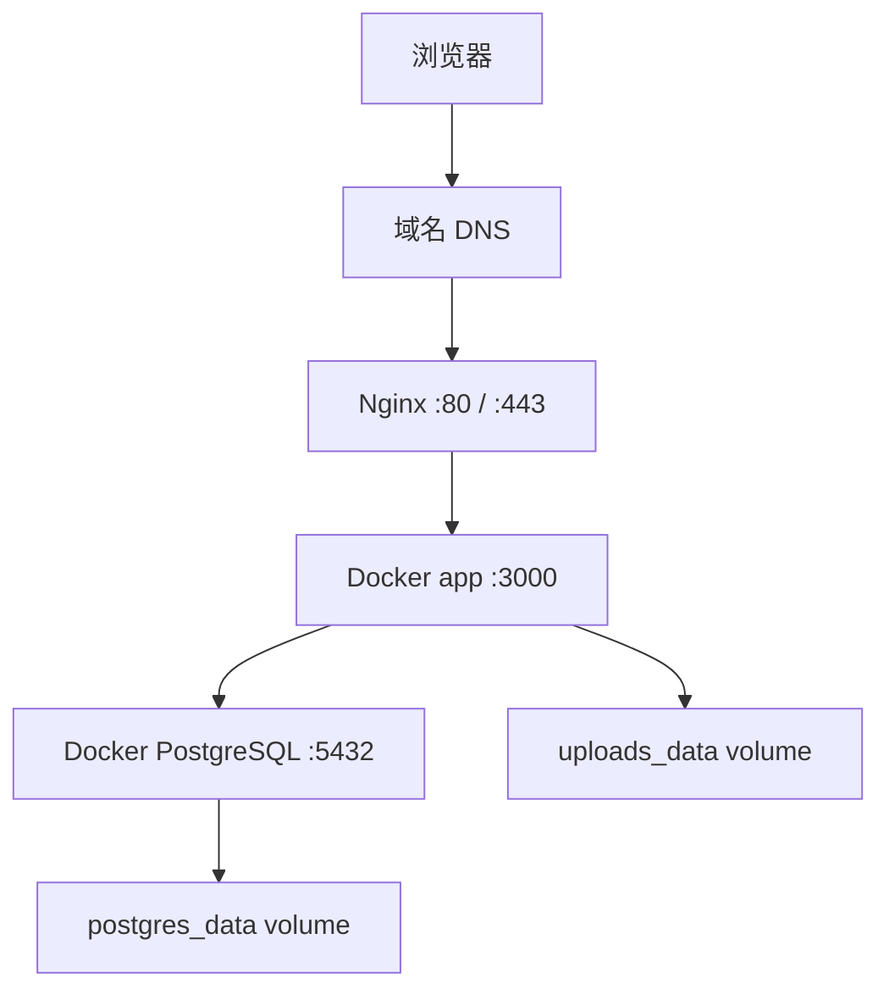

# 阿里云 Docker + Nginx + HTTPS 上线手册

## 适用范围

这份手册面向当前项目的推荐生产环境：

- 云服务器：阿里云 ECS
- 操作系统：Linux x86_64
- 应用部署：Docker Compose
- 反向代理：Nginx
- HTTPS：Let's Encrypt / Certbot

如果你是第一次接手这个项目，建议先读：

- [Docker 构建与发版指导](/Users/duobao/个人/个人-网站搭建/blog-01/docs/docker-build-and-release-guide.md)

## 目标拓扑



## 服务器前置准备

建议至少准备：

- 2C4G 或以上
- 一块系统盘和足够的可用空间
- 已备案域名
- 域名 A 记录指向 ECS 公网 IP

开放端口：

- `22`：SSH
- `80`：HTTP
- `443`：HTTPS

如果数据库只给容器内部使用，不要对公网开放 `5432`。

## 1. 安装基础组件

以 Ubuntu 为例：

```bash
sudo apt update
sudo apt install -y ca-certificates curl gnupg lsb-release git nginx certbot python3-certbot-nginx
```

安装 Docker：

```bash
curl -fsSL https://get.docker.com | sh
sudo systemctl enable docker
sudo systemctl start docker
sudo usermod -aG docker $USER
```

重新登录一次 shell 后，确认：

```bash
docker --version
docker compose version
nginx -v
certbot --version
```

## 2. 拉取项目

```bash
git clone <your-repo>
cd blog-01
```

建议把项目放在固定路径，例如：

```bash
/srv/blog-01
```

## 3. 配置环境变量

复制环境变量模板：

```bash
cp .env.example .env
```

至少修改这些值：

```env
POSTGRES_USER=blog
POSTGRES_PASSWORD=replace-with-strong-password
POSTGRES_DB=blog
APP_PORT=3000

BETTER_AUTH_SECRET=replace-with-strong-random-secret
BETTER_AUTH_URL=https://your-domain.com
NEXT_PUBLIC_SITE_URL=https://your-domain.com
ADMIN_SETUP_TOKEN=replace-with-strong-random-token

STORAGE_PROVIDER=local
```

说明：

- `BETTER_AUTH_URL` 和 `NEXT_PUBLIC_SITE_URL` 必须使用最终域名
- `POSTGRES_PASSWORD` 不能继续用示例值
- 如果你暂时不用对象存储，维持 `STORAGE_PROVIDER=local`

## 4. 启动容器

第一次上线：

```bash
docker compose up -d --build
docker compose run --rm --profile tools migrate
docker compose run --rm --profile tools seed
```

检查容器状态：

```bash
docker compose ps
docker compose logs app --tail=100
docker compose logs db --tail=100
```

如果此时直接访问 `http://服务器IP:3000` 正常，说明应用本体已经起来了。

## 5. 配置 Nginx 反向代理

新建站点配置：

```bash
sudo vim /etc/nginx/sites-available/blog-01.conf
```

示例配置：

```nginx
server {
    listen 80;
    server_name your-domain.com www.your-domain.com;

    client_max_body_size 20m;

    location / {
        proxy_pass http://127.0.0.1:3000;
        proxy_http_version 1.1;
        proxy_set_header Host $host;
        proxy_set_header X-Real-IP $remote_addr;
        proxy_set_header X-Forwarded-For $proxy_add_x_forwarded_for;
        proxy_set_header X-Forwarded-Proto $scheme;
        proxy_set_header Upgrade $http_upgrade;
        proxy_set_header Connection "upgrade";
    }
}
```

启用配置：

```bash
sudo ln -s /etc/nginx/sites-available/blog-01.conf /etc/nginx/sites-enabled/blog-01.conf
sudo nginx -t
sudo systemctl reload nginx
```

如果默认站点会冲突，可以先移除：

```bash
sudo rm -f /etc/nginx/sites-enabled/default
sudo nginx -t
sudo systemctl reload nginx
```

## 6. 配置 HTTPS

申请并安装证书：

```bash
sudo certbot --nginx -d your-domain.com -d www.your-domain.com
```

成功后验证自动续期：

```bash
sudo certbot renew --dry-run
```

常见结果：

- Certbot 会自动改写 Nginx 配置
- HTTP 会被重定向到 HTTPS
- 访问地址应改为 `https://your-domain.com`

## 7. 首次上线后的后台初始化

访问：

```text
https://your-domain.com/admin/login
```

然后做这几件事：

1. 用 seed 创建的管理员登录
2. 进入后台设置站点信息
3. 补全站点标题、描述、站点 URL、头像、Logo、社交链接
4. 上传一张图片验证媒体系统
5. 发布一篇测试文章

## 8. 日常发版

标准流程：

```bash
git pull
docker compose up -d --build
docker compose run --rm --profile tools migrate
```

检查：

```bash
docker compose ps
docker compose logs app --tail=100
curl -I https://your-domain.com
curl -I https://your-domain.com/admin/login
```

## 9. 回滚

如果新版本有问题：

```bash
git log --oneline -n 5
git checkout <上一个稳定提交或标签>
docker compose up -d --build
docker compose run --rm --profile tools migrate
```

注意：

- 如果数据库 schema 已经前滚，代码回退不一定等于数据也能自动回退
- 正式发版前最好先做数据库备份

## 10. 备份

### 数据库备份

```bash
docker compose exec -T db pg_dump -U "$POSTGRES_USER" "$POSTGRES_DB" > backup.sql
```

### 上传文件备份

如果使用 `local` 存储，至少要备份 `uploads_data` volume。

可选做法：

- 通过宿主机路径挂载替代匿名 volume
- 定时同步到 OSS / NAS / 备份盘

## 11. 监控与排障

### 看日志

```bash
docker compose logs app --tail=200
docker compose logs db --tail=200
sudo tail -n 200 /var/log/nginx/error.log
```

### 常见问题

#### 访问 502

通常先查：

- `docker compose ps`
- `docker compose logs app`
- Nginx upstream 是否写错

#### 登录异常

重点检查：

- `BETTER_AUTH_URL`
- `NEXT_PUBLIC_SITE_URL`
- HTTPS 是否已经生效
- 域名是否与环境变量一致

#### 图片上传后丢失

重点检查：

- 是否使用 `STORAGE_PROVIDER=local`
- `uploads_data` 是否是持久化 volume
- 有没有误删容器和 volume

#### SEO 地址仍然是 localhost

重点检查：

- `.env` 中 `NEXT_PUBLIC_SITE_URL`
- 后台站点设置里的 `siteUrl`

## 12. 推荐的宿主机目录结构

可以约定成：

```text
/srv/blog-01
  ├── .env
  ├── docker-compose.yml
  ├── backup/
  └── repo files...
```

如果后面要加强备份，建议把数据库备份和上传文件备份都收敛到 `/srv/blog-01/backup`。

## 13. 后续优化建议

适合下一阶段继续做：

1. 增加 `docker compose.prod.yml`
2. 增加健康检查接口，例如 `/api/health`
3. 将 `uploads_data` 切换为阿里云 OSS
4. 为 Nginx 增加缓存和更细的安全头
5. 为数据库和上传文件增加自动备份脚本
