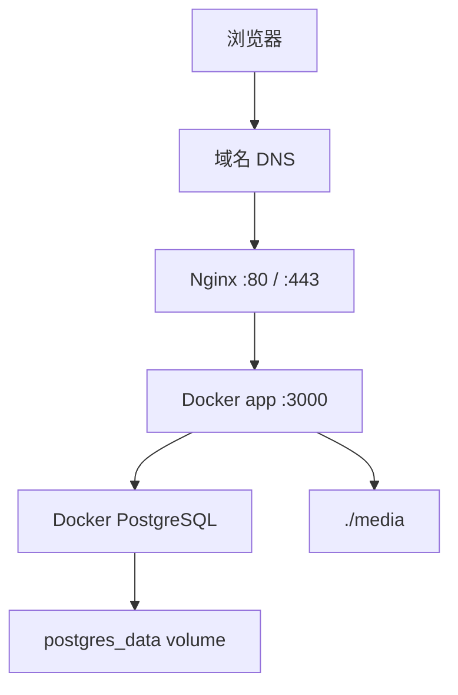

# 阿里云 Docker + Nginx + HTTPS 上线手册

这份手册描述的是第二阶段的正式上线方式：

- Docker Compose 跑 `app + db`
- 宿主机 Nginx 监听 `80/443`
- Nginx 反向代理到 `127.0.0.1:3000`
- 域名和 HTTPS 由 Nginx / Certbot 处理

## 目标拓扑



## 1. 服务器准备

建议开放端口：

- `22`
- `80`
- `443`

如果数据库只给容器内部用，不要开放 `5432`。

安装：

```bash
sudo apt update
sudo apt install -y ca-certificates curl gnupg lsb-release git nginx certbot python3-certbot-nginx
curl -fsSL https://get.docker.com | sh
sudo systemctl enable docker
sudo systemctl start docker
```

## 2. 启动应用

源码部署：

```bash
git clone <your-repo>
cd blog-01
cp .env.example .env
```

至少修改：

```env
POSTGRES_PASSWORD=replace-with-strong-password
BETTER_AUTH_SECRET=replace-with-strong-random-secret
BETTER_AUTH_URL=https://your-domain.com
SITE_URL=https://your-domain.com
ADMIN_SETUP_TOKEN=replace-with-strong-random-token
STORAGE_PROVIDER=local
```

启动：

```bash
docker compose up -d --build
docker compose run --rm --profile tools migrate
docker compose run --rm --profile tools seed
```

先验证应用本体：

```bash
curl -I http://127.0.0.1:3000
docker compose logs app --tail=100
docker compose logs db --tail=100
```

如果你现在走的是离线交付，而不是源码部署，请先按
[offline-image-delivery-guide.md](/Users/duobao/个人/个人-网站搭建/blog-01/docs/offline-image-delivery-guide.md)
把容器跑起来，再接入下面的 Nginx。

## 3. 配置 Nginx

创建站点配置：

```bash
sudo vim /etc/nginx/sites-available/blog-01.conf
```

示例：

```nginx
server {
    listen 80;
    server_name your-domain.com www.your-domain.com;

    client_max_body_size 20m;

    location / {
        proxy_pass http://127.0.0.1:3000;
        proxy_http_version 1.1;
        proxy_set_header Host $host;
        proxy_set_header X-Real-IP $remote_addr;
        proxy_set_header X-Forwarded-For $proxy_add_x_forwarded_for;
        proxy_set_header X-Forwarded-Proto $scheme;
        proxy_set_header Upgrade $http_upgrade;
        proxy_set_header Connection "upgrade";
    }
}
```

启用：

```bash
sudo ln -s /etc/nginx/sites-available/blog-01.conf /etc/nginx/sites-enabled/blog-01.conf
sudo rm -f /etc/nginx/sites-enabled/default
sudo nginx -t
sudo systemctl reload nginx
```

## 4. 配置 HTTPS

```bash
sudo certbot --nginx -d your-domain.com -d www.your-domain.com
sudo certbot renew --dry-run
```

成功后，正式访问地址应当是：

```text
https://your-domain.com
```

并且 `.env` 中这两个值必须与正式地址一致：

- `BETTER_AUTH_URL`
- `SITE_URL`

## 5. 上线后检查

至少检查：

- 首页
- `/admin/login`
- 管理员登录
- 新建文章
- 上传图片
- `/robots.txt`
- `/sitemap.xml`
- `/feed.xml`

## 6. 备份

当前自托管模式下，至少备份：

- `postgres_data`
- 项目目录下的 `./media`

## 7. 常见排障

### 登录 403

优先检查：

- `BETTER_AUTH_URL`
- 真实访问地址
- Nginx 代理头是否包含 `Host` 和 `X-Forwarded-Proto`

### 图片 404

优先检查：

- `./media` 目录里是否真的有文件
- `app` 服务是否挂载了 `./media:/app/public/media`

### SEO 地址仍是 localhost

优先检查：

- `.env` 中 `SITE_URL`
- 后台站点设置里的 `siteUrl`
