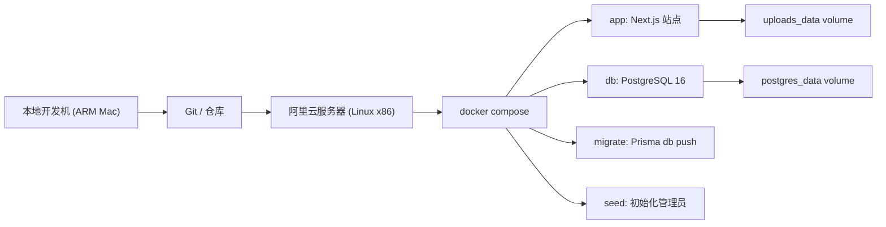

# Docker 构建与发版指导

## 文档目标

这份文档用于指导 `blog-01` 的容器化构建、部署、发版和交接。

适用场景：

- 当前维护者在阿里云 Linux x86 服务器上部署
- 本地开发机为 Apple Silicon / ARM
- 生产环境优先采用 `Docker Compose`
- 数据库也由 Docker 一起托管，部署模型接近 Typecho / WordPress 常见方案

这份文档默认以 `Docker Compose + PostgreSQL + Next.js App` 为主线；`Vercel` 作为可选补充方案。

相关文档：

- [阿里云 Docker + Nginx + HTTPS 上线手册](/Users/duobao/个人/个人-网站搭建/blog-01/docs/alicloud-docker-nginx-https-guide.md)
- [离线镜像交付与阿里云测试指南](/Users/duobao/个人/个人-网站搭建/blog-01/docs/offline-image-delivery-guide.md)
- [发版与回滚 Checklist](/Users/duobao/个人/个人-网站搭建/blog-01/docs/release-and-rollback-checklist.md)

## 当前部署模型



核心原则：

- 在目标环境构建，不复用本地 ARM 的 `.next` 或 `node_modules`
- 应用和数据库都放进 Compose，减少手工依赖
- 上传文件和数据库都必须持久化
- 生产构建阶段不依赖数据库在线

## 关键文件

- [Dockerfile](/Users/duobao/个人/个人-网站搭建/blog-01/Dockerfile)
- [docker-compose.yml](/Users/duobao/个人/个人-网站搭建/blog-01/docker-compose.yml)
- [.env.example](/Users/duobao/个人/个人-网站搭建/blog-01/.env.example)
- [README.md](/Users/duobao/个人/个人-网站搭建/blog-01/README.md)
- [layout.tsx](/Users/duobao/个人/个人-网站搭建/blog-01/src/app/layout.tsx)
- [media.service.ts](/Users/duobao/个人/个人-网站搭建/blog-01/src/features/media/services/media.service.ts)

## 服务说明

### `app`

Next.js 生产服务，默认监听容器内 `3000` 端口。

职责：

- 渲染公开站点与后台
- 提供认证、媒体上传、RSS、Sitemap 等接口
- 在 `STORAGE_PROVIDER=local` 时写入 `/app/public/uploads`

### `db`

PostgreSQL 16 容器。

职责：

- 存储文章、标签、分类、媒体、站点设置、认证数据

持久化：

- Volume: `postgres_data`

### `migrate`

一次性工具服务，用于执行 Prisma schema 同步。

命令：

```bash
docker compose run --rm --profile tools migrate
```

### `seed`

一次性工具服务，用于初始化管理员账号。

命令：

```bash
docker compose run --rm --profile tools seed
```

### `uploads_data`

本地媒体上传目录的 Compose volume。

适用条件：

- `STORAGE_PROVIDER=local`
- 需要保留服务器本地上传文件

## 环境变量

### 应用必须项

```env
BETTER_AUTH_SECRET=your-production-secret
BETTER_AUTH_URL=https://your-domain.com
NEXT_PUBLIC_SITE_URL=https://your-domain.com
ADMIN_SETUP_TOKEN=your-random-token
```

说明：

- `BETTER_AUTH_SECRET` 必须是强随机值
- `BETTER_AUTH_URL` 和 `NEXT_PUBLIC_SITE_URL` 必须使用正式域名
- `ADMIN_SETUP_TOKEN` 用于首次初始化管理员，建议保留

### Compose 内置数据库

```env
POSTGRES_USER=blog
POSTGRES_PASSWORD=change-me
POSTGRES_DB=blog
POSTGRES_PORT=5432
APP_PORT=3000
```

### 媒体存储

#### 方案 A：自托管推荐

```env
STORAGE_PROVIDER=local
```

特点：

- 最适合阿里云服务器自托管
- 上传文件随 Compose volume 一起持久化
- 需要你自己负责备份 `uploads_data`

#### 方案 B：Vercel / 对象存储友好

```env
STORAGE_PROVIDER=vercel-blob
BLOB_READ_WRITE_TOKEN=your-token
```

特点：

- 适合部署到 Vercel
- 上传文件不依赖本地磁盘
- 需要额外配置云端 Blob 凭证

## 首次部署流程

### 1. 服务器准备

建议服务器预装：

- Docker
- Docker Compose Plugin
- Git
- 反向代理或负载均衡组件，例如 Nginx

### 2. 拉取代码

```bash
git clone <your-repo>
cd blog-01
```

### 3. 配置生产环境变量

```bash
cp .env.example .env
```

然后编辑 `.env`，至少改掉这些值：

- `BETTER_AUTH_SECRET`
- `BETTER_AUTH_URL`
- `NEXT_PUBLIC_SITE_URL`
- `ADMIN_SETUP_TOKEN`
- `POSTGRES_PASSWORD`

### 4. 启动应用与数据库

```bash
docker compose up -d --build
```

### 5. 初始化数据库

```bash
docker compose run --rm --profile tools migrate
```

### 6. 初始化管理员

```bash
docker compose run --rm --profile tools seed
```

### 7. 首次登录后补全站点设置

后台需要尽快补齐：

- 站点标题
- 站点 URL
- 站点描述
- Logo / 头像
- 社交链接
- Footer 文案

原因：

- 未配置时，系统可能回退到静态默认配置
- SEO、站点品牌、分享卡片都会受影响

## 日常发版流程

### 标准发版

```bash
git pull
docker compose up -d --build
docker compose run --rm --profile tools migrate
```

如果这次涉及管理员初始化逻辑以外的普通代码更新，通常不需要重复执行 `seed`。

### 推荐发版顺序

1. 拉最新代码
2. 备份数据库
3. 备份上传文件
4. 重新构建并启动容器
5. 跑迁移
6. 做线上冒烟检查

## 冒烟检查清单

上线后至少检查这些页面和功能：

### 页面

- `/`
- `/blog`
- `/about`
- `/projects`
- `/admin/login`

### SEO / 系统文件

- `/robots.txt`
- `/sitemap.xml`
- `/feed.xml`

### 后台功能

- 管理员登录
- 新建文章
- 上传图片
- 发布文章
- 前台文章可访问

## 回滚策略

### 代码回滚

```bash
git checkout <previous-tag-or-commit>
docker compose up -d --build
```

### 数据回滚

如果 schema 变化导致兼容性问题，需要结合数据库备份恢复。

建议：

- 发版前做 PostgreSQL dump
- 对 `uploads_data` 做文件级备份

## 备份建议

### 数据库

可以在服务器定时执行：

```bash
docker compose exec db pg_dump -U "$POSTGRES_USER" "$POSTGRES_DB" > backup.sql
```

### 上传文件

如果使用 `local` 存储：

- 备份 Docker volume `uploads_data`
- 或者将其映射到宿主机目录并纳入系统备份

## ARM 到 x86 的注意事项

你当前的真实场景是：

- 本地开发机：ARM Mac
- 线上部署机：Linux x86

因此要遵守下面几条：

- 不要把本地 `.next` 目录直接传到服务器运行
- 不要把本地 `node_modules` 直接传到服务器运行
- 最稳的做法是在服务器上执行 `docker compose up -d --build`
- 如果必须在本地构建镜像并推送仓库，需要显式指定平台：

```bash
docker buildx build --platform linux/amd64 ...
```

## 已知限制

### `local` 存储模式

- 适合自托管
- 不适合无状态 Serverless 平台

### `vercel-blob` 模式

- 更适合 Vercel
- 需要真实云端凭证验证上传链路

### 构建验证

当前项目已经验证：

- `npm run lint` 通过
- `npm run build` 通过
- `docker compose config` 通过
- Webpack 模式下，构建不依赖数据库在线

但本地 Docker 镜像构建曾遇到 Docker Hub 元数据拉取异常，这更像本机 Docker / registry 环境问题，不是项目配置语法问题。

## 后续优化建议

### 优先级高

1. 为 `app` 增加显式健康检查接口，例如 `/api/health`
2. 把 Compose 中的 `uploads_data` 改成宿主机绑定目录或对象存储
3. 增加数据库自动备份脚本或定时任务
4. 引入 CI，在合并前自动跑 `lint` 和 `build`

### 优先级中

1. 增加 Nginx 示例配置
2. 增加 HTTPS / 反向代理说明
3. 增加日志采集和错误监控
4. 把 `db:push` 逐步升级为更可审计的 Prisma migration 流程

### 优先级低

1. 提供 `docker compose.prod.yml`
2. 增加对象存储提供方，例如 S3 / OSS / R2
3. 为 Vercel 路径补一份专门部署手册

## 交接给其他维护者时要说清楚的事

至少要同步这几件事：

1. 当前推荐部署方式是 `Docker Compose`，不是裸 Node 进程
2. 生产环境默认推荐 `STORAGE_PROVIDER=local`
3. `uploads_data` 和 `postgres_data` 都是必须备份的
4. 首次发版后要先登录后台补站点设置
5. ARM 开发机不能直接复用构建产物到 x86 服务器

## 最短上线命令

如果是熟悉项目的人，最短流程如下：

```bash
cp .env.example .env
vim .env
docker compose up -d --build
docker compose run --rm --profile tools migrate
docker compose run --rm --profile tools seed
```

完成后访问：

- 前台：`https://your-domain.com`
- 后台：`https://your-domain.com/admin/login`
