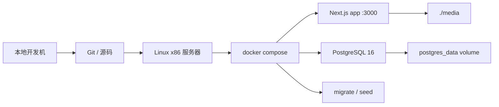

# Docker 构建与发版指导

这份文档描述当前项目保留的两条部署路径：

1. 源码部署：服务器拉仓库，用根目录 [docker-compose.yml](/Users/duobao/个人/个人-网站搭建/blog-01/docker-compose.yml) 启动
2. 离线交付：本地构建 `linux/amd64` 镜像，服务器只拿交付包部署

## 当前部署模型



## 关键文件

- [Dockerfile](/Users/duobao/个人/个人-网站搭建/blog-01/Dockerfile)
- [docker-compose.yml](/Users/duobao/个人/个人-网站搭建/blog-01/docker-compose.yml)
- [.env.example](/Users/duobao/个人/个人-网站搭建/blog-01/.env.example)
- [offline-image-delivery-guide.md](/Users/duobao/个人/个人-网站搭建/blog-01/docs/offline-image-delivery-guide.md)

## 一、源码部署

适用场景：

- 服务器能拉 Git 仓库
- 服务器能直接构建镜像
- 接受使用 `.env`

准备：

```bash
cp .env.example .env
```

至少修改：

```env
POSTGRES_PASSWORD=replace-with-strong-password
BETTER_AUTH_SECRET=replace-with-strong-random-secret
BETTER_AUTH_URL=https://your-domain.com
SITE_URL=https://your-domain.com
```

默认会自动准备管理员账号。普通部署流程直接访问 `/admin/login` 登录即可；`ADMIN_SETUP_TOKEN` 只作为高级保留项。

启动：

```bash
docker compose up -d --build db
docker compose run --rm --profile tools migrate
docker compose up -d app
```

应用容器启动时只执行 `npm start`，不会自动修改数据库结构。数据库同步必须通过 `migrate` 工具服务显式执行。

如需补一批联调文章，便于测试前台分页和后台筛选，可额外执行：

```bash
docker compose run --rm app npm run db:seed:demo-posts
```

这条命令会向当前数据库补充演示分类、标签和文章，不影响正常启动流程。

## 二、离线交付

适用场景：

- 本地是 ARM，服务器是 Linux x86
- 服务器不拉仓库或不走镜像仓库
- 希望交付物尽量傻瓜化

本地打包：

```bash
bash scripts/release/build-offline-bundle.sh
```

服务器部署详见：

- [offline-image-delivery-guide.md](/Users/duobao/个人/个人-网站搭建/blog-01/docs/offline-image-delivery-guide.md)

这条路径的特点是：

- 交付包里只有一个可编辑的 `config/docker-compose.yml`
- 服务器不需要 `.env`
- 服务器只需 `docker load`、编辑 compose、执行启动脚本

## 三、持久化和备份

当前实现下：

- PostgreSQL 使用 `postgres_data`
- 本地上传目录是项目根目录下的 `./media`

备份最少覆盖：

- `postgres_data`
- `./media`

## 四、发版建议

单机生产环境的推荐顺序：

1. 先备份数据库
2. 再备份 `./media`
3. 再更新应用镜像或代码
4. 跑 `migrate`
5. 做登录、发文、上传的冒烟验证
