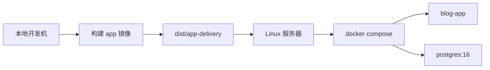

# Docker 构建与发版指导

这份文档只描述当前项目仍然在维护的两条部署路径：

1. 源码部署：服务器拉仓库，使用根目录 `docker-compose.yml`
2. 发布版交付：本地构建 app 镜像，生成 `dist/app-delivery` 后上传服务器

## 当前发布模型



## 关键文件

- [Dockerfile](/Users/duobao/个人/个人-网站搭建/blog-01/Dockerfile)
- [docker-compose.yml](/Users/duobao/个人/个人-网站搭建/blog-01/docker-compose.yml)
- [docker-compose.release.yml](/Users/duobao/个人/个人-网站搭建/blog-01/docker-compose.release.yml)
- [delivery/release/install.sh](/Users/duobao/个人/个人-网站搭建/blog-01/delivery/release/install.sh)
- [scripts/release/refresh-app-delivery.sh](/Users/duobao/个人/个人-网站搭建/blog-01/scripts/release/refresh-app-delivery.sh)

## 一、源码部署

适用场景：

- 服务器能拉 Git 仓库
- 服务器能直接构建镜像
- 当前仍在开发期，优先追求迭代效率

准备：

```bash
cp .env.example .env
```

至少修改：

```env
POSTGRES_PASSWORD=replace-with-strong-password
BETTER_AUTH_SECRET=replace-with-strong-random-secret
BETTER_AUTH_URL=https://your-domain.com
BETTER_AUTH_TRUSTED_ORIGINS=https://your-domain.com
SITE_URL=https://your-domain.com
SEED_ADMIN_PASSWORD=replace-with-strong-admin-password
```

启动：

```bash
docker compose up -d --build db
docker compose run --rm --profile tools migrate
docker compose up -d app
```

补测试数据：

```bash
docker compose run --rm --profile tools seed
docker compose run --rm --profile tools seed-demo-posts
```

## 二、发布版交付

适用场景：

- 你在本地开发完成后，要把当前版本交给服务器测试
- 服务器不跑源码构建
- 当前不依赖 Docker Hub，先走手工上传

### 1. 本地构建镜像

如果服务器是 `linux/amd64`：

```bash
docker buildx build --platform linux/amd64 -t blog-01-app:release --load .
```

### 2. 导出镜像并刷新交付目录

```bash
mkdir -p dist/app-delivery
docker save -o dist/app-delivery/blog-01-app-release.tar blog-01-app:release
bash scripts/release/refresh-app-delivery.sh
tar -C dist -czf dist/app-delivery-release.tar.gz app-delivery
```

### 3. 上传到服务器

上传：

- `dist/app-delivery-release.tar.gz`

### 4. 服务器安装

```bash
cd /root
rm -rf app-delivery
tar -xzf app-delivery-release.tar.gz
cd app-delivery
bash install.sh
```

如果你明确不想编辑配置：

```bash
bash install.sh . --no-edit
```

### 5. 首次部署后的重点检查

- `BETTER_AUTH_URL`
- `BETTER_AUTH_TRUSTED_ORIGINS`
- `SITE_URL`

这三个值必须和你实际访问后台时使用的地址完全一致。

当前产品规则：

- 固定管理员登录账号为 `admin`
- 首次部署后用户只需要修改密码和昵称
- 不提供修改登录账号的入口
- 如需多用户或角色管理，后续单独设计“用户管理”功能

## 三、当前不再维护的方案

以下旧方案已经废弃，不再作为正式交付链路维护：

- `dist/offline-delivery`
- `delivery/offline/*`
- `scripts/release/build-offline-bundle.sh`
- `scripts/release/import-offline-bundle.sh`
- `scripts/release/start-offline-stack.sh`

如果后续恢复离线交付，也应该基于当前 `app-delivery` 方案重新设计，而不是继续叠加旧脚本。
