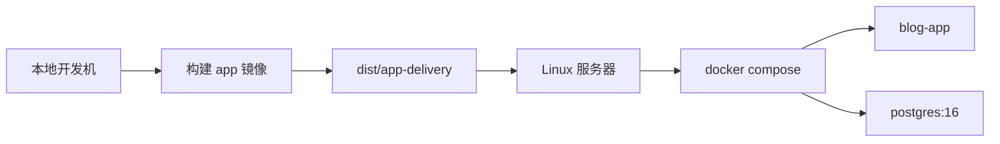

# Docker 构建与发版指导

这份文档只描述当前项目仍然在维护的两条部署路径：

1. 源码部署：服务器拉仓库，使用根目录 `docker-compose.yml`
2. 发布版交付：本地构建 app 镜像，生成 `dist/app-delivery` 后上传服务器

## 当前发布模型



当前数据库交付仍是双轨状态：

- 新仓库资产已经包含 `prisma/migrations` baseline，可作为后续 `prisma migrate deploy` 的起点
- 实际部署链路默认已经切到 `DB_SCHEMA_SYNC_MODE=auto`
- 历史环境是否适合切到 `migrate deploy`，应先通过 `npm run db:check:migrations` 判断

当前推荐把 `npm run db:check:migrations` 的结论理解为：

- `environment kind=empty`：新环境，优先考虑 `DB_SCHEMA_SYNC_MODE=migrate`
- `environment kind=legacy-without-history`：历史 `db push` 环境，先继续 `push`，做完 baseline resolve 再切 `migrate`
- `environment kind=baseline-ready`：baseline 已记录，已经具备走 `migrate deploy` 的前提，但仍要关注仓库里后续 migration 是否也已经应用
- `environment kind=migration-ready`：仓库里的 migration 已全部应用到当前环境，可优先使用 `DB_SCHEMA_SYNC_MODE=migrate`
- `environment kind=migration-blocked`：migration 状态异常，先排查，不要直接切 `migrate`

发布操作只按下面路径选择：

| 环境路径 | 覆盖的 `environment kind` | 发布模式 | 发布动作 |
| --- | --- | --- | --- |
| 新环境 | `empty` | `DB_SCHEMA_SYNC_MODE=migrate` | 先跑 `npm run db:preflight:release -- --schema`，通过后用共享 `schema-sync.sh` 入口执行 `migrate deploy` |
| 历史 baseline 过渡 | `legacy-without-history` | 继续 `auto` 或显式 `push`，不要直接切 `migrate` | 先跑 `npm run db:rehearse:baseline`，再执行 `npm run db:baseline -- --apply`，重新预检进入 baseline-ready 后再切 migrate |
| 已纳入 migration 管理 | `baseline-ready` / `migration-ready` | `DB_SCHEMA_SYNC_MODE=migrate` | `db:check:migration-coverage` 必须完整；缺失仓库 migration 时先应用缺失项，再宣称 fully migration-ready |
| 异常阻断 | `migration-blocked` | 暂停发布 | 先用 `db:check:migrations` 和 `npx prisma migrate status` 排查失败或未完成 migration |

部署配置层面，当前统一通过 `DB_SCHEMA_SYNC_MODE` 表达 schema 同步策略：

- `auto`：默认，正常数据库按状态在 `migrate` 和 `push` 之间选择；异常 migration 直接阻断
- `push`：显式兼容现状
- `migrate`：目标环境已 baseline 后使用
- `skip`：完全交给外部流程

旧变量 `RUN_DB_PUSH` 仍保留兼容，但 compose 默认已经不再主动注入它；后续应优先只使用 `DB_SCHEMA_SYNC_MODE`，只有迁移旧部署环境时才临时依赖 `RUN_DB_PUSH`。
当前 app 容器首启和 `migrate` 工具服务都复用同一个 `schema-sync.sh` 解析入口，因此模式解析和执行语义是一致的，不再需要分别追踪两套 `case` 分支。

## 关键文件

- [Dockerfile](../Dockerfile)
- [docker-compose.yml](../docker-compose.yml)
- [docker-compose.release.yml](../docker-compose.release.yml)
- [delivery/release/install.sh](../delivery/release/install.sh)
- [scripts/release/refresh-app-delivery.sh](../scripts/release/refresh-app-delivery.sh)

## 一、源码部署

适用场景：

- 服务器能拉 Git 仓库
- 服务器能直接构建镜像
- 当前仍在开发期，优先追求迭代效率

准备：

```bash
cp .env.example .env
```

至少修改：

```env
POSTGRES_PASSWORD=replace-with-strong-password
BETTER_AUTH_SECRET=replace-with-strong-random-secret
BETTER_AUTH_URL=https://your-domain.com
BETTER_AUTH_TRUSTED_ORIGINS=https://your-domain.com
SITE_URL=https://your-domain.com
ADMIN_SETUP_TOKEN=replace-with-one-time-setup-token
```

启动：

```bash
docker compose up -d --build db
docker compose run --rm --profile tools migrate
docker compose up -d app
```

如果某个环境已经完成 baseline，可以显式切换：

```bash
DB_SCHEMA_SYNC_MODE=migrate docker compose run --rm --profile tools migrate
DB_SCHEMA_SYNC_MODE=migrate docker compose up -d app
```

如果你不想手动判断，也可以直接沿用默认 `auto`：

- 空库、baseline-ready 和 migration-ready 环境会自动执行 `migrate deploy`
- 历史无迁移环境会自动保守回落到 `db push`
- migration 状态异常时会返回 `blocked` 并直接阻断启动，必须先修复 migration 状态

如果本次版本包含 Prisma schema 变更，当前推荐先用本地或服务器环境变量预览差异：

```bash
npm run db:preflight:release -- --schema
```

如果本次还触及站点设置单例语义或初始化逻辑，建议额外执行：

```bash
npm run db:check:site-settings
```

补测试数据：

```bash
docker compose run --rm --profile tools seed
docker compose run --rm --profile tools seed-demo-posts
```

## 二、发布版交付

适用场景：

- 你在本地开发完成后，要把当前版本交给服务器测试
- 服务器不跑源码构建
- 当前不依赖 Docker Hub，先走手工上传

### 1. 本地构建镜像

如果服务器是 `linux/amd64`：

```bash
docker buildx build --platform linux/amd64 -t blog-01-app:release --load .
```

### 2. 导出镜像并刷新交付目录

```bash
mkdir -p dist/app-delivery
docker save -o dist/app-delivery/blog-01-app-release.tar blog-01-app:release
bash scripts/release/refresh-app-delivery.sh
tar -C dist -czf dist/app-delivery-release.tar.gz app-delivery
```

如果本次交付包含数据库 schema 调整，建议在发布前先执行：

```bash
npm run db:preflight:release -- --schema
```

其中 `npm run db:check:sync-mode` 现在除了打印推荐模式，也会在 `db:preflight:release` 里承担门禁角色：

- 如果当前还是 `DB_SCHEMA_SYNC_MODE=auto`，它主要负责解释自动决策
- 如果你显式固定成 `push` 或 `migrate`，它会校验该模式是否和当前推荐模式一致

如果 `npm run db:check:migrations` 显示“schema exists but migration history is missing”，说明当前环境仍是历史 `db push` 数据库。此时不要直接假设可以安全切到 `migrate deploy`，应先做 baseline resolve，再切换交付策略。
如果 `npm run db:check:migrations` 显示 `environment kind=baseline-ready`，也不要直接把它当成“仓库 migration 已全部完成”；这只说明 baseline 已经记录，可以进入 migrate 语义。是否已经 fully migration-ready，需要再看 `npm run db:check:migration-coverage`。

推荐顺序：

```bash
npm run db:check:sync-mode
npm run db:check:migrations
npm run db:check:migration-coverage
npm run db:baseline
npm run db:baseline -- --apply
npx prisma migrate status
DB_SCHEMA_SYNC_MODE=migrate docker compose run --rm --profile tools migrate
```

如果你想先在本地确认整条链路真的能跑通，再去动历史环境，建议先执行：

```bash
npm run db:rehearse:baseline
```

它会在当前 `DATABASE_URL` 所指向数据库里创建一个临时 rehearsal schema，完整模拟：

- `prisma db push`
- `db:check:migrations`
- `db:baseline -- --apply`
- `prisma migrate status`
- `prisma migrate deploy`

完成后会自动清理该 schema。

### 3. 上传到服务器

上传：

- `dist/app-delivery-release.tar.gz`

### 4. 服务器安装

```bash
cd /root
rm -rf app-delivery
tar -xzf app-delivery-release.tar.gz
cd app-delivery
bash install.sh
```

如果你明确不想编辑配置：

```bash
bash install.sh . --no-edit
```

### 5. 首次部署后的重点检查

- `BETTER_AUTH_URL`
- `BETTER_AUTH_TRUSTED_ORIGINS`
- `SITE_URL`

这三个值必须和你实际访问后台时使用的地址完全一致。

当前产品规则：

- 固定管理员登录账号为 `admin`
- 首次部署后用户只需要修改密码和昵称
- 不提供修改登录账号的入口
- 如需多用户或角色管理，后续单独设计“用户管理”功能

## 三、当前不再维护的方案

以下旧方案已经废弃，不再作为正式交付链路维护：

- `dist/offline-delivery`
- `delivery/offline/*`
- `scripts/release/build-offline-bundle.sh`
- `scripts/release/import-offline-bundle.sh`
- `scripts/release/start-offline-stack.sh`

如果后续恢复离线交付，也应该基于当前 `app-delivery` 方案重新设计，而不是继续叠加旧脚本。


## 四、健康检查与备份

应用容器通过 `/api/health` 同时检查服务进程、数据库连接和核心 `post` 表。数据库容器继续使用 `pg_isready`。

生产环境建议每天执行一次：

```bash
BACKUP_RETENTION_DAYS=14 ./scripts/backup-docker.sh
```

保留期清理只处理脚本成功生成、带 `.blog-01-backup` 标记的时间戳目录，不会删除备份根目录下的普通文件夹。

恢复前必须先做一份当前备份，再显式确认：

```bash
CONFIRM_RESTORE=1 ./scripts/restore-docker.sh ./backups/备份时间目录
```

完整流程见 [数据库与媒体备份恢复](./backup-and-restore.md)。
