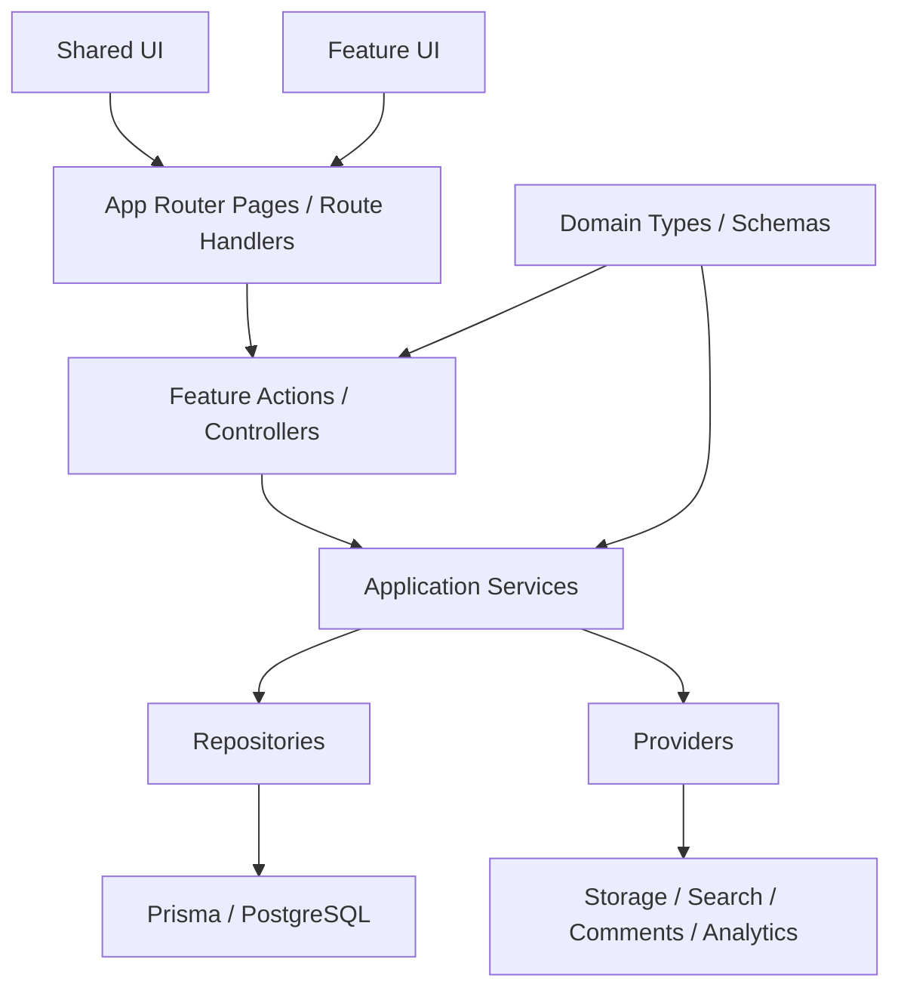

# Blog-01 架构优化方案

## 1. 目标

在**不牺牲当前功能完整度**的前提下，把项目优化成：

- 保持轻量：继续维持单体应用，不拆服务
- 易于扩展：后续增加评论、搜索、对象存储、多作者、内容导入导出时，不需要大面积改动
- 易于维护：页面层、业务层、数据访问层职责清晰
- 易于协作：开发能快速定位功能代码，不需要在 `app / actions / lib / components` 之间来回跳

结论先行：

> 当前项目最适合的方向不是“更重的架构”，而是“更清晰的模块化单体架构”。

---

## 2. 当前架构现状

### 2.1 当前优点

当前项目已经具备一个健康的 MVP 基础：

- 技术栈统一：`Next.js + React + Prisma + PostgreSQL + Better Auth`
- 内容模型克制：`post / category / tag / siteSetting / user`
- 前后台都在同一个应用内，部署和调试成本低
- SEO、RSS、后台发布、上传、权限等核心能力已具备

### 2.2 当前主要问题

当前问题不是“功能不够”，而是**边界开始模糊**：

1. 业务逻辑主要堆在 `src/actions/*.ts`
2. `src/lib/*.ts` 同时承担基础设施、领域工具、配置拼装等职责
3. 页面层直接依赖较多业务细节，未来扩展时容易把业务逻辑继续写回页面
4. 没有显式的“服务层 / 仓储层 / 扩展点”概念
5. 上传、SEO、站点设置、Markdown 渲染这些能力虽然可用，但没有统一成可替换能力

这类结构在项目小的时候很快，但当需求继续增长时，常见后果是：

- 一个功能的修改要同时碰页面、action、lib、数据库查询
- 新能力接入时容易“复制一套旧逻辑”
- 复用靠 copy，不是靠模块
- 某些基础能力替换成本高，比如本地上传改 S3/R2

---

## 3. 架构目标图



核心原则：

- `app` 负责路由与页面组合
- `feature` 负责业务模块
- `service` 负责业务规则
- `repository` 负责数据访问
- `provider` 负责未来可替换的外部能力

---

## 4. 推荐架构：模块化单体

### 4.1 保留的部分

以下部分不建议推翻：

- 保留 `Next.js App Router`
- 保留 `Prisma + PostgreSQL`
- 保留 `Better Auth`
- 保留 Markdown 内容形态
- 保留单库、单应用部署模式

这些已经足够支撑个人博客和后续若干轮扩展，不需要过度工程化。

### 4.2 要调整的部分

建议从“按技术类型分散”调整为“按领域模块组织”。

当前大致是：

- `src/app`
- `src/actions`
- `src/lib`
- `src/components`

目标建议是：

```text
src/
  app/
    (public)/
    admin/
    api/

  features/
    auth/
      actions/
      services/
      repositories/
      types/

    posts/
      actions/
      services/
      repositories/
      queries/
      types/
      schemas/
      components/

    taxonomy/
      actions/
      services/
      repositories/
      queries/
      types/

    settings/
      actions/
      services/
      repositories/
      queries/
      types/

    media/
      actions/
      services/
      providers/
      types/

  shared/
    ui/
    lib/
    config/
    types/

  infrastructure/
    db/
    auth/
    seo/
    markdown/
    storage/
```

说明：

- `features/*` 放业务能力
- `shared/*` 放真正通用的东西
- `infrastructure/*` 放与技术实现强绑定的能力

这比继续把所有逻辑平铺在 `actions` 和 `lib` 中更适合长期维护。

---

## 5. 分层职责建议

### 5.1 页面层（Page / Route）

职责：

- 接收路由参数
- 调用 query/action
- 组织页面组件
- 处理 `notFound`、`redirect`

不应承担：

- 业务规则
- 数据清洗
- 权限规则细节
- 多表写入流程

### 5.2 Action 层

职责：

- 鉴权
- 表单解析
- 调用 service
- 执行缓存刷新

不应承担：

- 大段数据库写入逻辑
- slug 规则、发布规则、状态迁移规则
- 上传策略选择

### 5.3 Service 层

职责：

- 文章发布规则
- slug 生成与校验
- 标签关联重建
- 站点设置合并策略
- 首个管理员初始化规则

这是后续扩展最关键的一层。

### 5.4 Repository 层

职责：

- Prisma 查询与写入
- 查询组合封装
- 保持返回结构稳定

收益：

- 后续替换查询实现时不影响上层
- 页面和 action 不再直接依赖 Prisma 细节

---

## 6. 建议的领域拆分

### 6.1 `features/posts`

负责：

- 文章 CRUD
- slug 生成
- 发布/草稿逻辑
- 阅读时长统计
- 文章列表查询
- 文章详情查询

建议拆分：

- `post.service.ts`
- `post.repository.ts`
- `post.query.ts`
- `post.schema.ts`

### 6.2 `features/taxonomy`

把分类和标签放在一个模块里，而不是完全平级散开。

负责：

- 分类管理
- 标签管理
- 分类/标签筛选查询

这样后续如果要加：

- 标签颜色
- 标签排序
- 分类层级

都更集中。

### 6.3 `features/settings`

负责：

- 站点设置读取与更新
- 动态站点配置解析
- 前台 header/footer/SEO 配置下发

这里建议把现在的 `site.ts` 进一步演进为：

- `settings.query.ts`
- `settings.service.ts`
- `site-config.service.ts`

### 6.4 `features/media`

这是非常值得提前整理的模块。

当前上传能力虽然可用，但未来很容易变化：

- 本地上传
- S3 / R2
- 图片压缩
- 图片尺寸裁剪
- 孤儿图片清理

所以这里建议从一开始就明确：

- `media.service.ts`
- `storage.provider.ts`
- `local-storage.provider.ts`

以后接对象存储时，不需要重写调用方。

### 6.5 `features/auth`

负责：

- session 获取
- admin 权限校验
- 首次管理员引导逻辑

把“认证”和“管理员 bootstrap”放在一个领域里，会比零散在 `lib/auth.ts` 和 route handler 更清晰。

---

## 7. 哪些地方应该预留扩展点

不是所有地方都值得抽象。只抽**未来真的可能替换**的点。

### 7.1 存储扩展点

建议定义：

```ts
interface StorageProvider {
  upload(input: UploadInput): Promise<UploadResult>;
  remove(key: string): Promise<void>;
  getPublicUrl(key: string): string;
}
```

初始实现：

- `LocalStorageProvider`

未来实现：

- `S3StorageProvider`
- `R2StorageProvider`

### 7.2 搜索扩展点

当前可以继续不做复杂搜索，但接口应预留：

```ts
interface SearchProvider {
  searchPosts(query: string): Promise<SearchPostResult[]>;
}
```

初始实现：

- 数据库 `LIKE / ILIKE`

未来实现：

- Meilisearch
- Algolia
- PostgreSQL 全文索引

### 7.3 评论扩展点

如果以后做评论，不建议直接把评论逻辑散落进文章模块。

建议抽象：

- `CommentProvider`
- `NoopCommentProvider`
- `SelfHostedCommentProvider`
- `ThirdPartyCommentProvider`

### 7.4 分析扩展点

例如：

- 页面访问统计
- 文章阅读量
- 事件埋点

也适合 provider 化，但不必现在实现完整能力。

---

## 8. 数据模型优化建议

当前核心模型是合理的，建议保持稳定：

- `user`
- `post`
- `category`
- `tag`
- `postTag`
- `siteSetting`

后续如果要扩展，建议按业务逐步增加，而不是提前加很多空表。

优先级较高的未来候选表：

### 8.1 `mediaAsset`

用于管理上传内容，而不是只返回 URL。

可包含：

- `id`
- `storageKey`
- `url`
- `mimeType`
- `size`
- `width`
- `height`
- `uploadedBy`
- `createdAt`

### 8.2 `postRevision`

如果以后要支持：

- 修订历史
- 回滚
- 自动保存

这个表会很有价值。

### 8.3 `redirectRule`

如果以后频繁改 slug，建议单独有重定向表，而不是靠临时逻辑处理。

---

## 9. 当前仓库的具体重构建议

### 9.1 第一阶段：只重组目录，不改行为

先做低风险重构：

- 新建 `src/features`
- 从 `src/actions/posts.ts` 中抽出 `posts/service.ts`
- 从 `src/actions/settings.ts` 中抽出 `settings/service.ts`
- 把 `src/lib/site.ts` 挪到 `features/settings`
- 把 `src/lib/seo.ts`、`src/lib/markdown.ts` 放进更明确的位置

这一步只改变结构，不改变功能。

### 9.2 第二阶段：建立服务层和仓储层

优先处理最核心的 3 个模块：

1. `posts`
2. `settings`
3. `media`

目标：

- action 只做入参与鉴权
- service 处理规则
- repository 处理 Prisma

### 9.3 第三阶段：补统一校验

建议加入 `zod`，统一表单与 action 入参校验。

这样以后：

- 后台表单
- API route
- 导入脚本

都能共用同一份 schema。

### 9.4 第四阶段：补测试

最值得先补的不是 UI snapshot，而是核心业务测试：

- 文章创建/更新/删除
- 发布状态变更
- 首个管理员 bootstrap
- 上传鉴权与类型限制
- 设置更新后前台配置是否生效

### 9.5 第五阶段：引入可替换 provider

按需做，不必一次性上全：

1. `StorageProvider`
2. `SearchProvider`
3. `CommentProvider`

---

## 10. 不建议做的事情

为了保持“功能完整但架构轻”，以下事情当前不建议做：

- 不要拆微服务
- 不要上事件总线/消息队列
- 不要做通用插件系统
- 不要提前设计多租户
- 不要把所有函数都包成 interface
- 不要为未来 1% 的需求牺牲现在 99% 的可维护性

这些会显著提升复杂度，但不会给当前项目带来成比例收益。

---

## 11. 推荐落地顺序

推荐按下面顺序做，而不是一次性大迁移：

1. 抽 `posts` 模块
2. 抽 `settings` 模块
3. 抽 `media` 模块并定义 `StorageProvider`
4. 统一 `zod` 校验
5. 补关键业务测试
6. 再考虑搜索、评论、修订历史

这条路线的优点：

- 风险小
- 每一步都能上线
- 不会打断现有开发节奏

---

## 12. 最终建议

对于 Blog-01，最适合的目标架构不是“极致轻静态”，也不是“企业级 CMS”。

最合适的定位是：

> 一个轻量、清晰、可持续扩展的模块化单体博客系统。

换句话说：

- 保留现在的技术栈
- 不增加部署复杂度
- 通过模块边界、服务层、仓储层、provider 扩展点来提升可扩展性

这比单纯追求“更轻”更符合你的目标，也更适合后续长期迭代。

---

## 13. 下一步执行建议

如果要立刻进入实施，我建议从下面两个动作开始：

### 方案 A：低风险起步

- 先把 `posts` 和 `settings` 抽成 feature 模块
- 不调整数据库
- 不改前台页面行为

适合：想先整理结构，不想影响当前交付节奏

### 方案 B：一步到位到可扩展基础

- 在方案 A 基础上，同时抽 `media` 模块
- 定义 `StorageProvider`
- 把上传逻辑从 route handler 中移入 service/provider

适合：你已经确定后面会接对象存储

我的建议是：**先走方案 B**。因为媒体上传是最容易在下一阶段发生变化的点，越早收口越值。
